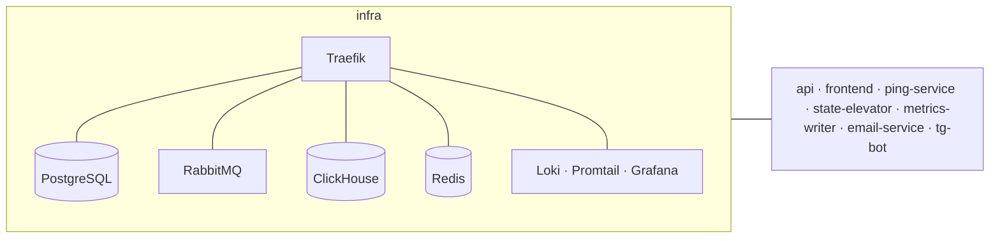

# PingTower Infra

Storages, message broker, reverse proxy and logging — plus one Makefile to run the whole stack.

Stack: Docker Compose, Traefik, PostgreSQL, ClickHouse, RabbitMQ, Redis, Grafana, Loki.

## Role in the system

Every PingTower service is its own repository with its own `docker-compose.yml`. This repository holds
everything they share: the stateful backing services, the RabbitMQ topology that wires services together,
the reverse proxy, centralized logging, and a Makefile that brings the whole system up in the right order
on a single Docker network, `pingtower_network`.



## What's inside

| Component | Image | Purpose |
| --- | --- | --- |
| **PostgreSQL** | `postgres:14.17` | users, servers, ping and notification settings (schema owned by api migrations) |
| **ClickHouse** | `clickhouse-server:24.8` | `server_pings` — ping history, `MergeTree`, daily partitions, 30-day TTL |
| **RabbitMQ** | `rabbitmq:3.12-management` | broker with exchanges, queues and bindings preloaded from `definitions.json` |
| **Redis** | `redis:7` | scheduler targets, runtime statuses, notification cooldowns (one db per service) |
| **Traefik** | `traefik:v3.0` | HTTPS entrypoint with Let's Encrypt, HTTP → HTTPS redirect |
| **Loki · Promtail · Grafana** | `3.0` / `11.0` | container log collection and search |

## Event bus

The topology is declared in [`rabbitmq/config/definitions.json`](rabbitmq/config/definitions.json) and documented as
an AsyncAPI contract in [`rabbitmq/asyncapi.yaml`](rabbitmq/asyncapi.yaml).

| Exchange / queue | Routing key | Producer | Consumers |
| --- | --- | --- | --- |
| `serverEventsExchange` (topic) | `server.target.added` / `updated` / `deleted` | api | `q.ping-service.server-events`, `q.state-elevator.server-events` |
| `pingEventsExchange` (topic) | `server.ping.recorded` | ping-service | `q.metrics-writer.ping-events`, `q.state-elevator.ping-events` |
| `statusEventsExchange` (topic) | `server.status.changed` | state-elevator | `q.api.status-events` |
| `emailQueue` (work queue) | — | api | email-service |
| `telegramQueue` (work queue) | — | api | tg-bot |

## Quick start

Clone all repositories side by side — the Makefile resolves sibling folders (`../api`, `../ping-service`, …):

```text
pingtower/
├── infra/  ├── api/  ├── frontend/  ├── ping-service/
├── state-elevator/  ├── metrics-writer/  ├── email-service/  └── tg-bot/
```

Create a `.env` from `.env.example` in `infra/` and in every service, then:

```bash
make -C infra up        # network → storages + broker → api migrations → all services
make -C infra ps        # status of every stack
make -C infra logs      # tail infra logs
make -C infra down      # stop everything
```

Partial targets: `infra-up`, `services-up`, `migrate`, and `<service>-up` / `<service>-down` for `api`, `email`,
`metrics`, `ping`, `state`, `tg-bot`, `frontend`. Run `make -C infra help` for the full list.

## Structure

```text
infra/
├── Makefile                 # orchestration of all stacks
├── postgres/                # PostgreSQL compose
├── clickhouse/              # ClickHouse compose + clickhouse-init/init.sql
├── rabbitmq/                # broker compose, config/definitions.json, asyncapi.yaml
├── redis/                   # Redis compose
├── proxy/                   # Traefik compose
├── logging/                 # Loki, Promtail, Grafana
└── erd.drawio               # data model diagram
```
